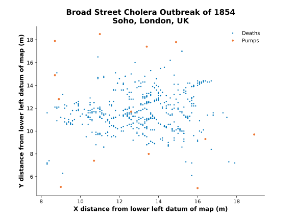

# Broad Street Cholera Outbreak of 1854

## In brevi

There was a severe outbreak of cholera in 1854 in the Soho district of London, England, which killed 616 people over one month. Dr. John Snow and Reverend Henry Whitehead linked the outbreak to contaminated water, identified the index case, and stopped the outbreak by having the Broad Street water pump disabled.

Deaths. The x-y values are the distances in m from the lower left datum of the map. Each pair represents one death. There are 578 values, slightly less than the 616 actual deaths.

Pumps. The x-y values are the distances in m from the lower left datum of the map. Each pair represents one pump. There are 13 values, representing 13 pumps.

## References

[John Snow site at UCLA](https://www.ph.ucla.edu/epi/snow.html).

Johnson, Steven (2007). The Ghost Map: The Story of London’s Most Terrifying Epidemic—and How it Changed Science, Cities, and the Modern World. 1st ed. New York, NY: Riverhead Books. isbn: 978-1-59448-269-4.

[Wikipedia 1854 Broad Street cholera outbreak](https://en.wikipedia.org/wiki/1854_Broad_Street_cholera_outbreak)
